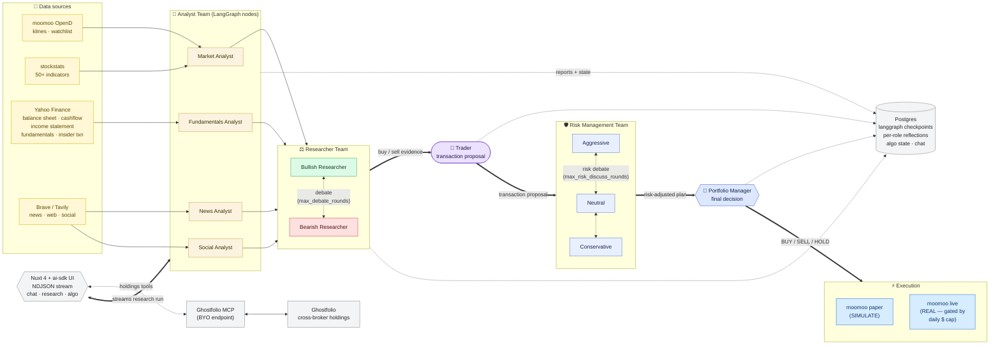

# ai-trader

Self-hosted trading copilot. Chat with an AI that has tools for moomoo market data + (later) Ghostfolio portfolio + algo trading.

**Plans 1 + 2 complete.** End-to-end:

- Log in (single password), see your moomoo watchlist in the sidebar.
- Ask `show NVDA daily` → real candlestick chart inline.
- Ask `what's on my watchlist?` → list pulled from your real moomoo account.
- Ask `add US.AAPL to my watchlist` / `remove US.NVDA` → mutates moomoo's watchlist.
- Ask `any news on NVDA?` → Tavily-powered news cards.
- Ask `show me my portfolio` → real positions + cash from your paper or live moomoo account (read-only).

## Prereqs

- Docker Desktop (or compose v2)
- moomoo OpenD installed on the host machine and **logged in**, listening on `127.0.0.1:11111`
- Anthropic API key
- (Optional but recommended) Tavily API key for news/web search — without it, search tools surface a clean error message and the rest still works

## First run

```sh
cp .env.example .env
# Edit .env:
#   APP_PASSWORD       — what you type to log in (anything)
#   SESSION_SECRET     — at least 32 random bytes
#   INTERNAL_BEARER    — random string, used between Nuxt and FastAPI
#   ANTHROPIC_API_KEY  — real sk-ant-… key
#   TAVILY_API_KEY     — tvly-… key for news/web search (optional)
#   POSTGRES_PORT      — host port for postgres (default 5432; override if 5432 is taken)

docker compose up -d --build
open http://localhost:3000
```

Sign in with `APP_PASSWORD`, then type `Show me NVDA daily` in the chat box.

If the chat returns an error like `Could not find API key process.env.ANTHROPIC_API_KEY`, your `ANTHROPIC_API_KEY` is the placeholder. Edit `.env` and `docker compose up -d --build web` again.

## Stop / clean up

```sh
docker compose down       # keep DB volume
docker compose down -v    # also wipe DB volume (resets users / chat history)
```

## Repo layout

```
apps/
  web/                 # Nuxt 4 + Nuxt UI v4 + Mastra (chat orchestration)
    app/               # Nuxt 4 layout: components, pages, layouts
    server/            # Nitro routes, middleware, mastra agent + tools
    db/                # Drizzle schema + migrations
    tests/             # vitest unit + playwright e2e
  api/                 # FastAPI wrapping moomoo OpenD
    app/               # routers, services, schemas
    tests/             # pytest
docker-compose.yml
```

## Architecture

```
┌──────────────────── docker compose ─────────────────────┐
│  web (Nuxt 4 + ai-sdk)   :3000   chat • research • algo │
│  api (FastAPI)           :8000   TradingAgents          │
│                                  (LangGraph multi-agent)│
│  agents-cron             daily reflection trigger       │
│  drizzle-migrate         one-shot schema sync           │
│  postgres (16-alpine)    chat • runs • algo • agents    │
└──┬──────────────┬──────────────────┬────────────────────┘
   │              │                  │
   ▼              ▼                  ▼
 moomoo OpenD   LLM APIs           external HTTP
 (host :11111)  • Anthropic        • Brave / Tavily (search)
 • market data  • OpenAI           • Yahoo Finance (fundamentals)
 • watchlist    • Google           • Ghostfolio MCP (BYO endpoint)
 • paper trade  • DeepSeek            └→ Ghostfolio (cross-broker)
```

- The Nuxt server runs **`ai-sdk`** (plus `@modelcontextprotocol/sdk` for the Ghostfolio MCP client) and proxies market data + paper-trading calls to FastAPI.
- The FastAPI side embeds [**TradingAgents**](https://github.com/TauricResearch/TradingAgents) — a LangGraph multi-agent debate (analysts → bull/bear researchers → trader → risk panel → portfolio manager). Run checkpoints + per-role reflections persist via `langgraph-checkpoint-postgres`. Algo strategies/runs/signals are also written from this side via asyncpg, so both services share the Drizzle-managed schema.
- [**Ghostfolio MCP**](https://github.com/mhajder/ghostfolio-mcp) is a remote MCP endpoint you bring yourself (set `GHOSTFOLIO_MCP_URL` + bearer); it talks to your [**Ghostfolio**](https://github.com/ghostfolio/ghostfolio) instance and gives the agent cross-broker holdings/performance/dividends tools. Leave it unset and the agent simply doesn't see the `ghostfolio_*` tools.
- The agent streams **NDJSON** chunks (`run-start`, `node-start`, `node-end`, `tool-call`, `tool-result`, `debate-round`, `risk-debate-turn`, `report`, `decision`, `synthesis`, `final-state`) which the chat + research UIs parse inline.

### Research pipeline

One `/research/<symbol>` run flows through the TradingAgents LangGraph: four analysts pull from their own data sources, two researchers debate, the trader proposes a transaction, three risk personas debate the proposal, the portfolio manager calls it, and the decision lands as either a paper or (gated) live order on moomoo.



**Role overview**

| Role | What it does | Inputs |
| --- | --- | --- |
| **Market Analyst** | Reads price + computes indicators (MACD, RSI, SMA family, …). | moomoo k-lines → `stockstats` |
| **Fundamentals Analyst** | Walks balance sheet / cashflow / income statement / insider activity. | Yahoo Finance (via Nuxt `/internal` proxy) |
| **News Analyst** | Pulls symbol-specific + global market news. | Brave (primary) / Tavily (fallback) |
| **Social Analyst** | Sentiment read of recent chatter around the ticker. | Brave / Tavily |
| **Bull / Bear Researchers** | Debate the analyst reports for `max_debate_rounds` turns. | Analyst reports |
| **Trader** | Synthesises debate into a concrete proposal (direction, sizing rationale). | Debate transcript |
| **Aggressive / Neutral / Conservative Risk** | Debate the trader's proposal from three risk stances. | Proposal + reports |
| **Portfolio Manager** | Authorises BUY / SELL / HOLD with a confidence + reasoning. | Risk debate |
| **Execution** | Places the order against `SIMULATE` (paper) by default; `REAL` is gated by `MAX_DAILY_LIVE_NOTIONAL_USD`. | Manager decision → moomoo OpenD |

After every authorised decision, the Reflector reads the four analyst reports + both debate transcripts and writes a per-role reflection to Postgres — next time that role runs on a similar setup, its top-K nearest reflections are injected into context.

## Tests

```sh
# api: pytest with fake OpenD client (no live OpenD needed)
cd apps/api && uv run pytest

# web: vitest unit
cd apps/web && pnpm exec vitest run

# web: playwright e2e (requires the docker stack running + a real ANTHROPIC_API_KEY)
cd apps/web && pnpm exec playwright test
```

The e2e test passes if either a chart canvas OR an inline error message appears — so it works with both real and placeholder API keys.

## What's next (later plans)

- Plan 3: paper trading (place/modify/cancel orders via chat) + push subscriptions (live ticker / orderbook streaming)
- Plan 4: options chain viewer + screener UI + Ghostfolio MCP integration
- Plan 5: algo backtesting via backtrader + scheduled live algo strategies
- Plan 6: live broker trading (with confirmation gates) + polish
