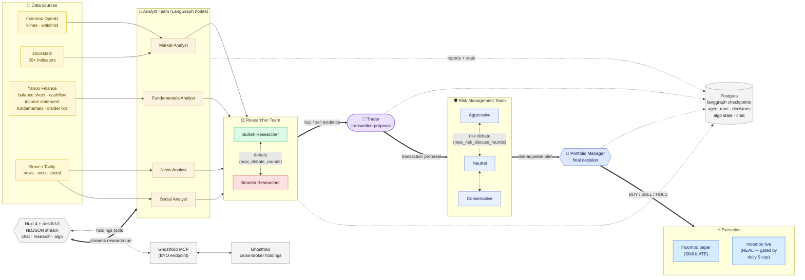

# ai-trader

Self-hosted trading copilot. Chat with an AI that has tools for moomoo market data/trading, Ghostfolio portfolio reconciliation, TradingAgents research, and paper-only algo workflows.

**Current end-to-end flow:**

- Log in (single password), see your moomoo watchlist in the sidebar — or in the
  navigation drawer on a phone, where the same rail (watchlist + past
  conversations) moves behind the ☰ button.
- Ask `show NVDA daily` → real candlestick chart inline.
- Ask `what's on my watchlist?` → list pulled from your real moomoo account.
- Ask `add US.AAPL to my watchlist` / `remove US.NVDA` → mutates moomoo's watchlist.
- Ask `any news on NVDA?` → Tavily-powered news cards.
- Ask `show me my portfolio` → real positions + cash from your paper or live moomoo account; Ghostfolio MCP can add tracker/reconciliation context when configured.
- Ask for a full ticker analysis → TradingAgents runs analysts, bull/bear debate, risk review, and a portfolio-manager verdict.
- Manage paper algo strategies from `/algo`; scheduler order placement is paper-only.

## Prereqs

- Docker Desktop (or compose v2)
- moomoo OpenD installed on the host machine and **logged in**, listening on `127.0.0.1:11111`
- An API key for at least one online model provider: Anthropic, OpenAI, Google, DeepSeek, or OpenRouter. You add it in the app under Settings, not in `.env`.
- (Optional but recommended) Tavily API key for news/web search — without it, search tools surface a clean error message and the rest still works

## First run

```sh
cp .env.example .env
# Edit .env:
#   APP_PASSWORD       — what you type to log in (anything)
#   SESSION_SECRET     — at least 32 random bytes
#   INTERNAL_BEARER    — random string, used between Nuxt and FastAPI
#   ENCRYPTION_KEY     — encrypts stored provider keys; generate with `openssl rand -base64 32`
#   TAVILY_API_KEY     — tvly-… key for news/web search (optional)
#   POSTGRES_PORT      — host port for postgres (default 5432; override if 5432 is taken)

docker compose up -d --build
open http://localhost:3000
```

Sign in with `APP_PASSWORD`, open **Settings**, add a model provider, and pick a chat model and a quick model (see [Model providers](#model-providers)). Then type `Show me NVDA daily` in the chat box. The empty chat also offers four opening prompts drawn from your watchlist, holdings, and recently triggered alerts; they redraw on every new chat and fall back to a static set when nothing is configured yet.

If the chat says "No model provider is configured", nothing has been saved in Settings yet. The link under the chat box goes there.

## Model providers

Settings (`/settings`, also reachable from the `model · …` badge in the header) holds the LLM configuration. Nothing about models lives in `.env` except `ENCRYPTION_KEY`.

- **Providers.** Add as many as you like from the online providers: Anthropic, OpenAI, Google, DeepSeek, and OpenRouter. Local model servers such as Ollama are not supported. Every provider needs an API key. Each uses its public endpoint unless you switch on **Override base URL**, for example to route through a company proxy. For models none of these host directly, use OpenRouter.
- **Keys.** A key is encrypted with AES-256-GCM under `ENCRYPTION_KEY` before it is stored. The page shows only its last four characters. Editing a provider with the key field blank keeps the stored key. Changing or losing `ENCRYPTION_KEY` makes stored keys unreadable, so re-enter them if you rotate it.
- **Test connection.** Lists the provider's models. When the provider is selected for a role, it also sends a short request to the selected model, so a wrong model id shows up here rather than in chat.
- **Models.** Two roles. The **chat model** runs chat, risk reports, strategy authoring, and the research debate's deep-thinking agents. The **quick model** runs news angles and the debate's fast analyst passes. Each role picks a provider and a model id. The model field suggests the provider's model list and accepts any id you type.
- **Removing a provider.** Blocked while either role uses it. Point the role at another provider and save first.
- **Upgrading from `LLM_MODEL` env vars.** On first start with an empty provider table, the web service imports `LLM_MODEL`, `LLM_MODEL_QUICK`, and the matching `*_API_KEY` from its environment into Settings and logs `[llm] imported …`. It runs once. After that the env vars are ignored and can be deleted.
- **Cost.** `/usage` prices calls for models in the built-in price table. Other models show as unpriced.

Behind a reverse proxy, long chat and research streams can sit quiet between tokens. nginx drops a proxied response after 60 s of silence by default. Raising `proxy_read_timeout` (for example to `600s`) on the location that serves the web app is optional but avoids cut-off replies.

## Stop / clean up

```sh
docker compose down       # keep DB volume
docker compose down -v    # also wipe DB volume (resets users / chat history)
```

## Repo layout

```
apps/
  web/                 # Nuxt 4 + Nuxt UI v4 + AI SDK chat orchestration
    app/               # Nuxt 4 layout: components, pages, layouts
    server/            # Nitro routes, middleware, chat prompt + tools
    db/                # Drizzle schema + migrations
    tests/             # vitest unit + playwright e2e
  api/                 # FastAPI wrapping moomoo OpenD
    app/               # routers, services, schemas
    tests/             # pytest
docker-compose.yml
```

## Architecture

```
┌──────────────────── docker compose ─────────────────────┐
│  web (Nuxt 4 + ai-sdk)   :3000   chat • research • algo │
│  api (FastAPI)           :8000   TradingAgents          │
│                                  (LangGraph multi-agent)│
│  drizzle-migrate         one-shot schema sync           │
│  postgres (16-alpine)    chat • runs • algo • agents    │
└──┬──────────────┬──────────────────┬────────────────────┘
   │              │                  │
   ▼              ▼                  ▼
 moomoo OpenD   LLM APIs           external HTTP
 (host :11111)  • Anthropic        • Brave / Tavily (search)
 • market data  • OpenAI           • Yahoo Finance (fundamentals)
 • watchlist    • Google           • Ghostfolio MCP (BYO endpoint)
 • paper trade  • DeepSeek            └→ Ghostfolio (cross-broker)
```

- The Nuxt server runs **`ai-sdk`** (plus `@modelcontextprotocol/sdk` for the Ghostfolio MCP client) and proxies market data + paper-trading calls to FastAPI.
- The FastAPI side embeds [**TradingAgents**](https://github.com/TauricResearch/TradingAgents) — a LangGraph multi-agent debate (analysts → bull/bear researchers → trader → risk panel → portfolio manager). Run checkpoints persist via `langgraph-checkpoint-postgres`. Algo strategies/runs/signals are also written from this side via asyncpg, so both services share the Drizzle-managed schema.
- [**Ghostfolio MCP**](https://github.com/mhajder/ghostfolio-mcp) is a remote MCP endpoint you bring yourself (set `GHOSTFOLIO_MCP_URL` + bearer); it talks to your [**Ghostfolio**](https://github.com/ghostfolio/ghostfolio) instance and gives the agent cross-broker holdings/performance/dividends tools. Leave it unset and the agent simply doesn't see the `ghostfolio_*` tools. Only the read-only subset listed in `GHOSTFOLIO_TOOL_ALLOWLIST` (`apps/web/server/llm/mcp.ts`) is exposed to the model; the server's write tools (create/delete accounts and activities, imports, balance transfers) are never reachable from chat.

### Two portfolio layers, never summed

Ghostfolio mirrors the moomoo account, so the two sources overlap on purpose:

| Layer | Source | Chat tools | Page |
|---|---|---|---|
| **Investments** — what you own on moomoo live, with day change and P&L | moomoo OpenD | `investment_portfolio`, `investment_performance`, `holdings_context` | `/portfolio` (moomoo tables) |
| **Net worth** — every account incl. cash and non-investment assets | Ghostfolio | `portfolio_performance`, `ghostfolio_*` reads | `/portfolio` (headline, allocation, planning) |

`holdings_context` reports both quantities for a symbol and flags a mismatch as a reconciliation issue rather than extra shares. Opening `/portfolio` records the day's snapshot of both layers (at most one automatic snapshot per UTC day; the performance card's capture button adds a manual one at any time), and the equity curve refreshes when a new point lands. There is no background scheduler, so days the page is not opened have no snapshot. The net-worth snapshot is recorded only when Ghostfolio reports a total; a moomoo account total (live or paper) is never written as net worth.

### Chat tool catalogue

Tools are defined in `apps/web/server/llm/tools.ts` and the routing rules in `apps/web/server/llm/chat-context.ts`. A unit test (`tests/unit/chat-prompt-tool-names.test.ts`) fails when the prompt or a slash command names a tool that no longer exists.

| Group | Tools |
|---|---|
| market | `market_kline`, `market_snapshot`, `market_order_book` |
| watchlist | `watchlist_list`, `watchlist_add`, `watchlist_remove` |
| news / web | `news_pulse` (stock news + the macro/sector context behind a move), `search_news` (topics that are not one ticker), `search_web` |
| broker (moomoo) | `trade_accounts`, `trade_account_overview`, `trade_portfolio`, `trade_orders`, `trade_fills` (today by default, pass `start`/`end` for history), `trade_place_order`, `trade_modify_order`, `trade_cancel_order` |
| portfolio | `investment_portfolio`, `investment_performance`, `holdings_context`, `portfolio_performance`, `portfolio_mpt_analysis`, `convert_fx` |
| research | `agents_debate`, `research_start`, `research_status`, `research_get`, `investment_research`, `thesis_tracker`, `dyp_ask`, `value_stock`, `value_screen`, `technical_analysis` |
| algo (paper only) | `algo_list`, `algo_backtest`, `algo_recent_signals`, `algo_state`, `algo_kill`, `algo_unkill` |
| alerts / usage | `alert_create`, `alert_list`, `alert_cancel`, `usage_summary` |

### Safety rails

- Live (REAL) orders need `ALLOW_LIVE_TRADING=true` on the api **and** a typed confirmation phrase in the chat turn. Placement and modification both count against `MAX_DAILY_LIVE_NOTIONAL_USD`; orders moomoo reports at price 0 (market orders) are valued at the last trade.
- The TradingAgents pipeline stops at `AGENTS_DAILY_COST_USD_CAP` per day across runs, resumes and every backtest pair.
- Algo strategies run in an AST-validated sandbox: no imports beyond math/numpy/pandas/statistics, no dunder access, and no pandas/numpy file IO methods (`read_*`, `to_*`, `np.load`, ...). Every backtest and every live `on_bar` call runs in a child process with a wall-clock limit (`ALGO_BACKTEST_TIMEOUT_SEC`, `ALGO_STRATEGY_TIMEOUT_SEC`), so a runaway loop is killed and reported instead of stalling the api. The scheduler only ever places paper orders.
- Valuations are computed in the currency the company reports in. When the quote trades in another currency (an HKD-listed company reporting in CNY) the price series is converted at the current FX rate and the result says so; the card labels prices with the ISO code.
- The agent streams **NDJSON** chunks (`run-start`, `node-start`, `node-end`, `tool-call`, `tool-result`, `debate-round`, `risk-debate-turn`, `report`, `decision`, `synthesis`, `final-state`) which the chat + research UIs parse inline.

### Long replies and runs survive the browser

Chat replies and research runs are generated on the server, apart from the page that asked for them. Closing the tab, reloading, or losing the network does not cut them short.

- **Chat.** Reopening a chat while its reply is still generating replays the reply so far and follows it to the end. After a dropped connection the page waits until it is back online, then reattaches once. If that fails too, a card under the thread shows the error with **retry**. A chat takes one reply at a time. Sending is blocked while a reply is generating, and a send from a second tab puts the text back in the box and follows the running reply. **Stop** ends the generation on the server and keeps the partial reply, marked stopped. A reply that ended with an error or was stopped, or a question left without a reply (the web container restarted mid-reply), shows the same card with **retry**. Retrying does not save the question twice. Deleting a chat stops its reply.
- **Ghostfolio.** The chat waits at most 3 s for the Ghostfolio MCP server. If the server is down, the reply goes ahead without the `ghostfolio_*` tools, and the connection is retried after 60 s.
- **Research.** Leaving or reloading `/research/<symbol>` does not stop a run. Reopening the page replays its events and follows the rest, and a run started from chat or another tab shows up the same way. A symbol has at most one running run. Starting another, from the page or from chat, follows the one already running instead. A dropped stream reconnects on its own, and so does a stream that goes silent for 45 s (the server pings every 15 s). After repeated failures the page shows **connection lost** with **reconnect**, separate from the run's own status. The api sends heartbeats during long silent steps, and a run whose upstream goes quiet for 90 s ends as failed rather than hanging. A run whose start cannot reach the api ends as failed. If the web or api restarts mid-run, the run ends as failed. **Cancel** stops a running run; a run that finished first keeps its result. **Resume** continues a failed or cancelled run from its last checkpoint with the same options, and its events continue the same timeline. The button is disabled while the resume request is pending, and a completed run cannot be resumed.

### Research pipeline

One `/research/<symbol>` run flows through the TradingAgents LangGraph: four analysts pull from their own data sources, two researchers debate, the trader proposes a transaction, three risk personas debate the proposal, the portfolio manager calls it, and the decision lands as either a paper or (gated) live order on moomoo.


```mermaid
flowchart LR
    %% ───── Data sources ─────
    subgraph SRC["📡 Data sources"]
        direction TB
        MOOMOO["moomoo OpenD<br/>klines · watchlist"]
        STOCK["stockstats<br/>50+ indicators"]
        YAHOO["Yahoo Finance<br/>balance sheet · cashflow<br/>income statement<br/>fundamentals · insider txn"]
        SEARCH["Brave / Tavily<br/>news · web · social"]
    end

    %% ───── Analyst Team ─────
    subgraph ANL["🔬 Analyst Team (LangGraph nodes)"]
        direction TB
        MA["Market Analyst"]
        FA["Fundamentals Analyst"]
        NA["News Analyst"]
        SA["Social Analyst"]
    end

    %% ───── Researcher debate ─────
    subgraph RES["⚖️ Researcher Team"]
        direction TB
        BULL["Bullish Researcher"]
        BEAR["Bearish Researcher"]
        BULL <-. "debate<br/>(max_debate_rounds)" .-> BEAR
    end

    TRADER(["💼 Trader<br/>transaction proposal"])

    %% ───── Risk debate ─────
    subgraph RISK["🛡️ Risk Management Team"]
        direction TB
        AGG["Aggressive"]
        NEU["Neutral"]
        CON["Conservative"]
        AGG <-. "risk debate<br/>(max_risk_discuss_rounds)" .-> NEU
        NEU <-. " " .-> CON
    end

    MGR{{"👔 Portfolio Manager<br/>final decision"}}

    %% ───── Execution + side systems ─────
    subgraph EXEC["⚡ Execution"]
        direction TB
        PAPER["moomoo paper<br/>(SIMULATE)"]
        LIVE["moomoo live<br/>(REAL — gated by<br/>daily $ cap)"]
    end

    DB[("Postgres<br/>langgraph checkpoints<br/>agent runs · decisions<br/>algo state · chat")]
    UI{{"Nuxt 4 + ai-sdk UI<br/>NDJSON stream<br/>chat · research · algo"}}
    GFMCP["Ghostfolio MCP<br/>(BYO endpoint)"]
    GF["Ghostfolio<br/>cross-broker holdings"]

    %% ───── Flow ─────
    MOOMOO --> MA
    STOCK --> MA
    YAHOO --> FA
    SEARCH --> NA
    SEARCH --> SA

    MA --> RES
    FA --> RES
    NA --> RES
    SA --> RES

    RES == "buy / sell evidence" ==> TRADER
    TRADER == "transaction proposal" ==> RISK
    RISK == "risk-adjusted plan" ==> MGR
    MGR == "BUY / SELL / HOLD" ==> EXEC

    ANL -. "reports + state" .-> DB
    RES -. " " .-> DB
    TRADER -. " " .-> DB
    MGR -. " " .-> DB

    UI <== "streams research run" ==> ANL
    UI <-. "holdings tools" .-> GFMCP
    GFMCP <--> GF

    %% ───── Styling ─────
    classDef src fill:#fff7d6,stroke:#d4b400,color:#5a4500
    classDef anl fill:#fbf3df,stroke:#caa84a,color:#3a2f00
    classDef bull fill:#dcfbe6,stroke:#3aa860,color:#0e3a1c
    classDef bear fill:#fde0e0,stroke:#c44d4d,color:#4b1010
    classDef trader fill:#ece1ff,stroke:#7c4ed1,color:#241144
    classDef risk fill:#e8f0ff,stroke:#5a7bd6,color:#15224a
    classDef mgr fill:#dde7ff,stroke:#3a5fcc,color:#0f1f4a
    classDef exec fill:#d6ecff,stroke:#2f6fdc,color:#103366
    classDef our fill:#f3f4f6,stroke:#888,color:#222

    class MOOMOO,STOCK,YAHOO,SEARCH src
    class MA,FA,NA,SA anl
    class BULL bull
    class BEAR bear
    class TRADER trader
    class AGG,NEU,CON risk
    class MGR mgr
    class PAPER,LIVE exec
    class DB,UI,GFMCP,GF our
```

**Role overview**

| Role | What it does | Inputs |
| --- | --- | --- |
| **Market Analyst** | Reads price + computes indicators (MACD, RSI, SMA family, …). | moomoo k-lines → `stockstats` |
| **Fundamentals Analyst** | Walks balance sheet / cashflow / income statement / insider activity. | Yahoo Finance (via Nuxt `/internal` proxy) |
| **News Analyst** | Pulls symbol-specific + global market news. | Brave (primary) / Tavily (fallback) |
| **Social Analyst** | Sentiment read of recent chatter around the ticker. | Brave / Tavily |
| **Bull / Bear Researchers** | Debate the analyst reports for `max_debate_rounds` turns. | Analyst reports |
| **Trader** | Synthesises debate into a concrete proposal (direction, sizing rationale). | Debate transcript |
| **Aggressive / Neutral / Conservative Risk** | Debate the trader's proposal from three risk stances. | Proposal + reports |
| **Portfolio Manager** | Authorises BUY / SELL / HOLD with a confidence + reasoning. | Risk debate |
| **Execution** | Places the order against `SIMULATE` (paper) by default; `REAL` is gated by `MAX_DAILY_LIVE_NOTIONAL_USD`. | Manager decision → moomoo OpenD |

Each run starts fresh: agents do not carry lessons from past decisions into later runs. The only extra context is the deterministic DCF valuation, which the Research Manager and Risk Manager see before they rule.

## Tests

```sh
# api: pytest with fake OpenD client (no live OpenD needed)
cd apps/api && uv run pytest

# web: vitest unit + typecheck
cd apps/web && pnpm exec vitest run && pnpm exec nuxi typecheck

# web: playwright e2e (requires the docker stack running + a chat model chosen in Settings)
cd apps/web && pnpm exec playwright test
```

The e2e test passes if either a chart canvas OR an inline error message appears — so it works with or without a working model key.

`scripts/repro/` holds runtime checks for the streaming behaviour above (dropped chat connections, long silent debate steps, api restarts mid-run, resume). They run against the compose stack; see `scripts/repro/README.md`. The debate checks restart the api with `AGENTS_STUB_RUN_SECONDS` set, which swaps the TradingAgents graph for a stub that sleeps that long and decides `hold` without calling a model. Never set it in `.env`.

## What's next (later plans)

- Push subscriptions: live ticker / orderbook streaming
- Options chain viewer + screener UI
- Financial planning hub: goals, target allocation, rebalancing, liabilities, cashflow, and net-worth history
- Trade-safety evals + tool-call trace normalization (framework-free, against existing Postgres)
- Live broker trading polish: stronger approval UX, max-notional policies, audit ledger, and account allowlists
